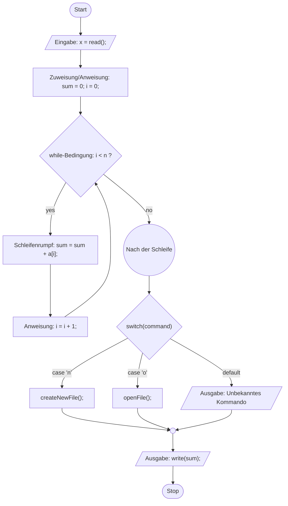

[[Altkausuren]]
# Teil 1: Einführung
bro so was soll ich dazu überhaupt schreiben idk
Code ist eine Anreihung von Anweisungen dings
# Teil 2: Objektbasierte Programmierung
## Kapselung
Abstraktionsebene zwischen Dingen außerhalb und innerhalb von Klasse (z.B. Getter und Setter) erleichtert Wartung und [[#Komposition statt Vererbung!|Modifikationen am gekapselten Stuff]].
## Primitivity


|                       | Primitive                                                            | Non-Primitive                                                                                                                            |
| --------------------- | -------------------------------------------------------------------- | ---------------------------------------------------------------------------------------------------------------------------------------- |
| Beispiele             | `int`, `boolean`                                                     | `String`, `Array`, jede custom class                                                                                                     |
| Wert                  | direkt die Daten selbst                                              | eine **referenz** auf die Adresse mit den Daten                                                                                          |
| Als Methodenparameter | Methode erhält Kopie des Werts, kann den "äußeren" Wert nicht ändern | Methode erhält Kopie der Referenz (kann also die Daten dennoch ändern, [[#Call-by-Value (Referenzen)\|⚠️ aber nicht bei reassignment!]]) |
## Modulo-Operator
Hier gibt es 1 wichtiges Detail, das relevant werden kann:

| in Mathe                     | in Java        |
| ---------------------------- | -------------- |
| `13 % 6 == 7`                | `13 % 6 == 7`  |
| `-13 % 6 == -7 + 6 + 6 == 5` | `-13 % 6 == 7` |
In Java ist `a mod b` mit `a<0` also der absolute Wert des Rests von $\frac{a}{b}$. In Mathe nimmt man stattdessen den negativen Rest und addiert so lange `b` bis man `>0` ist. (Da alle Werte die `b` auseinander sind, hinsichtlich `mod b` äquivalent sind.)

# Pre-/Post-Increment/Decrement

| `a++`/`a--` | Wert von `a` gelesen und im Execution Stack gespeichert, dann wird `a` in Memory in-/dekrementiert. |
| ----------- | --------------------------------------------------------------------------------------------------- |
| `++a`/`--a` | `a` wird in-/dekrementiert, dann wird der Wert gelesen.                                             |

> [!danger] Deswegen liebe ich EIDI
> Natürlich verwöhnt uns Big P hier wieder mit dem EIDI-Classic:
> 
> *"Having to understand code that would instantly get you fired at a real job"*
> 
> Da beim Assignment `a=a++` der Wert von `a` zuerst im **Execution Stack** gespeichert wird, und die anschließende In-/Dekrementierung in **Memory** gespeichert wird, wird beim anschließenden Reassignment von `a` noch der alte Wert vor der Änderung aus dem **Execution Stack** verwendet. Die Anweisung `a=a++` ändert also nicht den Wert von `a`. (Keine Sorge du musst nicht wissen was ein **Execution Stack** ist.)

## Decorators
### Access Modifier

| **Modifier**     | **Klasse** | **[[#Package]]** | **Unterklasse** | **Welt (Global)** |
| ---------------- | ---------- | ---------------- | --------------- | ----------------- |
| `public`         | ✅          | ✅                | ✅               | ✅                 |
| `protected`      | ✅          | ✅                | ✅               | ❌                 |
| _(kein Keyword)_ | ✅          | ✅                | ❌               | ❌                 |
| `private`        | ✅          | ❌                | ❌               | ❌                 |
### Other Keywords
| *decorator* | *function*                                                                                                                                                                                                                                                                                                       |
| ----------- | ---------------------------------------------------------------------------------------------------------------------------------------------------------------------------------------------------------------------------------------------------------------------------------------------------------------- |
| `abstract`  | - Methoden: Deklarierung ohne Implementierung<br>- Klassen: uninstanziierbar -> kann keine Objekte haben (see also: [[#Abstraktion/ Interface s\|Interfaces]])<br>- Alle Klassen, die mindestens eine `abstract` Methode haben, **müssen** `abstract` sein                                                       |
| `final`     | - Variablen<br>  - [[#Primitivity\|primitives]]: Konstanter Wert (kann nicht in **runtime** geändert werden)<br>  - [[#Primitivity\|non-primitives]]: nur der Wert, also die Referenz ist `final`, nicht die Daten auf die sie zeigt<br>- Klassen: kann nicht **[[#Abstraktion/ Interface s\|extended]]** werden |
| `static`    | - Gehört nicht dem jeweiligen Objekt, sondern der Klasse an sich<br>- Kann ohne bestimmte Referenz auf oder Existenz eines Objekts verwendet werden<br>- Useful für Konstanten (mit `static`) oder id (`static int count=count; int id=count++;`[^2])                                                            |
| `default`   | Nur in [[#Interfaces]] möglich, entfernt sozusagen das hier automatisch anwesende `abstract`, sodass wir eine Implementierung für die Methode angeben können.                                                                                                                                                    |

[^2]: wobei das laut meinem actual SWE Freund mit 10 Jahren Industrieerfahrung Giga Anti-Pattern ist lol

### Package
- Zur Gruppierung verwandter Klassen
- Alle Klassen in einem File sind in einem Package
- Für Package mit mehreren Files: Ordner `myPackage` machen und die Files darin mit `package myPackage;` versehen
## Call-by-Value (Referenzen)
Bei [[#Primitivity|Non-Primitive]] Methodenargumenten übergibt Java **Kopien der Referenz**. Modifizierung des Objekts (z.B. `arr[0]=1`) ändert das **Original-Objekt im Heap**. Reassignment der Variable auf (neues) Objekt (z.B. `arr = new int[1]`) ändert nur die **lokale Kopie** der Referenz und hat außen keine Auswirkung.
# Teil 3: Testen
## Die Idee
Die Idee (bei Unit-Tests, eigentlich gibts auch noch andere wie z.B. Implementation Tests aber nicht Stoff) ist folgende:
Wir zerhacken unseren Code in die minimalen Bestandteile, idealerweise Funktionen ohne Side-Effects (nur Input und Output) und schreiben für jede Tests, bei denen wir Inputs providen und einen bestimmten Output dafür erwarten. So wissen wir direkt, wo genau der Fehler liegt. Wir schreiben sowohl Tests für das **Base-Case** (erwartbare Inputs), als auch für **Edge Cases** (weniger erwartbare Inputs). Eine gute Weise die Test-Cases zu strukturieren sind sogenannte Testklassen, bei denen man mit einer Reihe von Fallunterscheidungen alle möglichen Kombinationen und so alle Situationen abdeckt.

> [!info] Welcome to Reality
> Meistens geht das mit dem Zerhacken nicht so schön, weil viele Methoden in der echten Welt inheränt Side-Effects haben (außer man ist auf Hascell-FP-Trip). Ich muss z.B. auf Arbeit oft Unit Tests schreiben für Methoden die auf ne DB zugreifen. Oder die Methode ist abgesehen von den Parametern noch von anderem Stuff abhängig, wie z.B. Datum. Hier braucht man dann Mocking, wodurch man versucht, möglichst nur die Methode im Test zu testen und alles andere zu imitieren und damit abzuschotten.

## Syntax
```
@Test  // Test annotation
public void testForBitFlip(){
    int a = 6;
    int b = 7;
    int c = a+b;
    assertEquals(c,13); // assert-Keyword (there's a bunch)
}
```

> [!danger] Niemals [[#Primitivity|Non-Primitives]] mit `==` vergleichen!
> Dann vergleichst du nur deren Referenzen du ==Dulli==. Mach einfach `asssertEquals()` du ==Dulli==.

# Teil 4: Kontrollstrukturen
broo free, außer maybe die hier:
## Ternary Operator
```java
a = b ? c : d
```
 ist äquivalent zu
```java
if (b)
{
	a=c
}
else
{
	a=d
}
```
## Switch-Case
### -Statement
```java
switch (a)
{
	case 1:
		System.out.println("eins");
		break;
	case 2:
		System.out.println("zwei");
		break;
	case 3: case 4:
		System.out.println("drei oder vier");
		break;
	default:
		System.out.println("out of bounds");
}
```
Ohne die `break` Statements, würde danach einfach das nächste Case getestet werden, quasi als wären es einfach lauter `if`s (und `default` eine normale Anweisung). Das wäre hier z.B. ein Problem, wenn statt `blablab()` der Wert von `a` auf `2` gesetzt wird.
### -Expression
Das ganze geht auch fancier, und zwar wenn es keine Anweisung, sondern ein Ausdruck sein soll:
```java
System.out.println(
	switch (a)
	{
		case 1 -> "eins";
		case 2 -> "zwei";
		case 3,4 -> "drei oder vier";
		default -> "out of bounds";
	}
)
```
Dann braucht man wegen dem `->` auch keine breaks.
### do-while
Der Böse Couseng von `while`, voll praktisch manchmal:
```java
do 
{
	userInput = getUserInputOrSmth();
}
while (userInput.isInvalid());
```
Die Schleife wird halt immer mindestens 1x ausgeführt, bevor die Condition überhaupt gecheckt wird.
## Kontrollflussdiagramm
Beispiel:


# Teil 5+6: Arrays und andere abstrakte Datentypen
## Arrays
### Matrixmultiplikation
```python
# (pseudocode)
for i in zeilen:
	for j in spalten:
		skalarprodukt(i,j)
		
skalarprodukt(a,b):
	for i,j in a,b:
		output += i*j
```
### Dynamic Array
Auch nur ein normales (statisches) Array under the Hood aber mit resizing Logik eingebaut. Die Idee ist, dass die Resizing Operation, bei der der Inhalt des Arrays in ein größeres Array kopiert wird, recht selten passiert, sodass es insgessamt relativ effizient ist. Warum macht man das? Bessere Speichernutzung, siehe [[#Array vs List]].
### Array vs [[#List]]

|                                            | Array                                                                                                                                                                                    | List                                           |
| ------------------------------------------ | ---------------------------------------------------------------------------------------------------------------------------------------------------------------------------------------- | ---------------------------------------------- |
| Cache Effizienz                            | *die Elemente liegen direkt hintereinander im Speicher, hilft bei Iteration durch Array wegen räumlichem Lokalitätsprinzip ([[Einführung in die Rechnerarchitektur#Cache\|siehe ERA]]))* | **die Elemente sind weiß Gott wo im Speicher** |
| Time Complexity Zugriff                    | *$O(1)$*                                                                                                                                                                                 | **$O(n)$**                                     |
| Kapazität                                  | **bei Initialisierung definiert und dann fix**                                                                                                                                           | *dynamisch*                                    |
| Speicherbedarf                             | **ggf größer als nötig (wenn nicht ganz voll)**                                                                                                                                          | *genau so groß wie nötig*                      |
| Zwischeneinfügen, Entfernen mit Nachrücken | **sehr komplex, alles hinter Element muss verschoben werden**                                                                                                                            | *easy clap*                                    |
## Collections
Eine Sammlung an [[#Interfaces]] für Datenstrukturen und deren Implementierungen
### List
>**Ne Liste halt.**

Standard Implementierungen: `LinkedList`, `ArrayList`
#### Wichtige Methoden
- `add()`, `addFirst()`
- `remove()`
- `clone()`
- `get()`
- `indexOf()`
- `toArray()`
- `contains()`
- `size()`
#### Custom Implementierung als Linked List
- Klasse `Node` mit [[#Teil 8 Rekursion|Referenz zur nächsten]] (bei Double Linked auch zur vorigen) Node
- *Optional* (aber sehr sinnvoll): Wrapper-Klasse mit Referenzen `head` und `tail` zu erster und letzter Node
- *Optional*: Abstraktionsebene zwischen `Node` und Daten mit Referenz zu Objekt der Klasse `Data` in `Node`, die tatsächliche Daten enthält
- *Optional:* Kompositum-Pattern, `abstract` Klasse `Element`, von der `Node` und `End` erben, dann kann sehr viel Spaghetti Logik, durch Methoden ersetzt werden, die in den beiden unterschiedlich implementiert werden (z.B. Sortiert einfügen Methode vergleicht bei `Node` und gibt ggf an Nachfolger weiter, während `End` direkt einfügt, da Ende erreicht)

### Set
> **Keine Duplikate, keine garantierte Reihenfolge, also keine Indices (wie in Mathe halt).**

Standard Implementierungen: `HashSet`, `TreeSet`, `LinkedHashSet`
Wichtige Methoden:
- `add()`
- `remove()`
- `contains()`
- `size()`
### Map
> **Key-Value-Pairs (Telefonbuch type shit), Key muss unique sein**

Standard Implementierungen: `HashMap`, `TreeMap`, `LinkedHashMap`
Wichtige Methoden:
- `put()`
- `get()`
- `remove()`
- `containsKey()`
- `keySet()` (returnt [[#Set]] der Keys)

Spezialversion: Hash-Table, quasi ne Liste an Hash-Maps, wo mit der Hash-Funktion jeder Wert eindeutig eine der Hash-Tabellen zugewiesen bekommt. (siehe auch [[Einführung in die Rechnerarchitektur#Cache|Cache in ERA]], der Funktioniert genau so). Warum macht man das? Ermöglicht sehr schnellen Zugriff, aber verliert dafür nicht die [[#Array vs List|Vorteile einer List]].

## High-Level Strukturen
### Queue (FIFO)
Implementierung mit [[#List|Linked List]]
Wichtige Methoden:
- `enqueue()`: Fügt Element vorne ein
- `dequeue()`: Entfernt Element hinten
- `poll()`: wie `dequeue()` aber entfernt nicht
### RingBuffer (FIFO)
Implementierung mit [[Array]]
An sich ähnlich zu [[#Queue (FIFO)|Queue]], auch hier wird nur vorne eingefügt und nur hinten entnommen. Der Trick ist, dass irgendwann index `0` frei wird und dann einfach das Element, das an Stelle `length` eingefügt werden soll, an `0` eingefügt wird. Erreicht wird das mit `realIndex = index % capacity`. Implementierung benötigt hierfür Indices für `head` und `tail`, bei leerem und vollen Buffer sind sie identisch (Unterscheidung möglich, da leere Elemente ge`null`t werden).
### Stack (LIFO)
Implementierung mit [[#List|Linked List]]
Wichtige Methoden:
- `push()`: Fügt Element hinten ein
- `pop()`: Entfernt Element hinten
- `peek()`: wie `pop()` aber entfernt nicht

## Implementierung
### Komposition statt Vererbung!
Wird eine Datenstruktur A durch Nutzung einer anderen Struktur B implementiert, ist **Vererbung (`A extends B`) suboptimal**, da B nicht **[[#Kapselung|gekapselt]]** bleibt (Bsp: `Stack extends ArrayList` erbt `add(0,x)`, was **LIFO bricht**). Durch **Komposition** (B als Attribut) bleibt man **flexibel**, falls B später gegen eine andere Struktur ausgetauscht werden soll.
### Generische Datentypen
Die generische Form **`A<B>`** macht primär dann Sinn, wenn B den **Typ der in A gespeicherten Elemente** definiert (z.B. eine Liste von B-Objekten).

## Sorting Algs
### $O(n^2)$
#### Bubble Sort
Iteriert durch das Array, für jedes Element, bewege es so lange nach rechts wie es größer als der rechte Nachbar ist.
#### Selection Sort
Sucht im unsortierten Teil des Arrays das **kleinste Element** und vertauscht es mit dem ersten Element des unsortierten Teils.
#### Insertion Sort
Man nimmt das nächste unsortierte Element und "fügt" es an der **richtigen Stelle** in den bereits sortierten Teil ein, indem man größere Elemente nach rechts verschiebt.
### $O(d+n)$
#### Radix Sort
Vergleicht keine Zahlen direkt. Stattdessen werden die Zahlen in "Eimer" (Buckets) sortiert, basierend auf ihren einzelnen Ziffern (zuerst die Einerstelle, dann die Zehnerstelle usw.). Also wird für das sortieren dieser noch ein Sorting-Alg gebraucht
### $O(n \log n)$

#### Merge Sort
Das Array wird rekursiv in immer kleinere Hälften gespalten, bis nur noch Einzelteile übrig sind. Diese werden dann in der richtigen Reihenfolge wieder **zusammengeführt (merged)**.
# Teil 7: Objektorientierung
## Vererbung
- Keyword `extends`
- Unterklasse übernimmt alle Methoden und Attribute, kann diese aber überschreiben
- Man kann nur von 1 Klasse erben
## Interfaces
- Keywords `Interface` und `implements`
- Alle Methoden eines Interfaces sind automatisch `public` und `abstract`
- mit `default` kann aber dennoch eine Implementierung vorgenommen werden
- Man kann beliebig viele Interfaces implementieren
- Interfaces können auch andere Interfaces `extend`en

![[Pasted image 20260131162811.png|500]]
## Enums
Nützlich, wenn es eine begrenze Anzahl an Belegungen geben soll für Variable.
```java
enum Beziehungsstatus
{
	LEDIG, LIIERT, VERHEIRATET, VERWITWET
}
Beziehungsstatus b = Beziehungsstatus.VERHEIRATET;
```
## Polymorphie
### Statischer vs. Dynamischer Typ
`StaticType o = new DynamicType()`
Der **statische Typ** bestimmt die sichtbaren **[[#Methodensignatur|Methodensignaturen]]** für den Compiler; der **dynamische Typ** bestimmt die ausgeführte **Implementierung** der JVM.
### Methodensignatur
Name (nicht Return-Type), Parametertypen und Reihenfolge (nicht Namen)
aka ==public static int== **method**(**String** ==hallo,== **int** ==hallo==)
### Generics & Bounds
Bei `A<U extends C>` ist die Konstruktion **`new A<C>()`** erlaubt, da für die Typprüfung und Generics **jede Klasse als Subtyp ihrer selbst** betrachtet wird.
### Casting
```java
oldStaticType object = new dynamicType();
newStaticType object = (newStaticType) object;
```

Erstellt ein neues Objekt mit dem alten **dynamischen** und dem in Klammern angegebenen neuen **statischen** Typ.
Wenn neuer statischer Typ in der Vererbungshierarchie unter dem dynamischen liegt, gibts `ClassCastException`.
Ein **Upcast** (von extender auf extendee) schränkt die **Sichtbarkeit** auf Methoden ein, die im **statischen Zieltyp** deklariert sind.
#### Implizit vs Explizit
Entlang der Vererbungsrichtung (in Pfeilrichtung) castet Java implizit aka automatisch (da keine Daten verloren gehen).
Andersrum muss man explizit casten.
Das gilt auch bei primitiven Typen.
![[Polymorphie.pdf#page=1&rect=447,42,548,167|Polymorphie, p.1|300]]
### **Und welche scheiß Methode wird jetzt aufgerufen?**
![[Polymorphie.pdf#page=2&rect=45,187,549,658|Polymorphie, p.2]]
*In other words*: Such bei statischem Typ (oder wenn nichts gibt bei dessen Oberklassen) die Methode raus, die am besten passt. Dann nimmt die in der Vererbungshierarchie möglichst nah am dynamischen Typen liegende Implementierung dieser Methode. (Und zwar mit exakt der selben Signatur!)
#### Best Fitting Methode
Zunächst werden alle Methoden ausgesucht, deren [[#Methodensignatur]] auf den Call passt (auch wenn dafür [[#Implizit vs Explizit|implizite Parametercasts]] notwendig sind).
Für jeden supplied Parameter wird geschaut, welche dieser Methoden diesen mit den wenigsten [[#Implizit vs Explizit|impliziten Casts]] annehmen kann. Gibt es eine Methode, die für alle Parameter der beste Fit ist, wird sie gewählt, sonst ein `Ambiguity Error` geworfen.

# [[#Teil 8: Rekursion]]

> [!hint] Holy shit warum verbringen wir soviel Zeit mit Rekursion
> \<rant\>
> du wirst das nie in deinem Job brauchen
> Die wichtigsten Anwendungen für Rekursion finden sich bei Giga-Low-Level Zeug wie [[#Custom Implementierung als Linked List|Linked Lists]] oder [[#Merge Sort]]. Also Zeug das schlaue Leute vor 30 Jahren ==schon für dich gemacht haben==! Du wirst auf Arbeit nie ein Ticket assigined bekommen "bitte bau einen custom sortalg" dikkahhh
> \</rant\>
## Aufbau
- Base Case (Abbruchbedingung)
- Rekursiver Aufruf
- Logik
- Return
## Backtracking
Die Idee is basically, dass du nicht immer alle rekursiven Branches betrachten musst. Wenn du z.B. nach etwas suchst, kannst du als `return`-value ne `boolean` nehmen, die der Methode Bescheid sagt, ob ihre rekursiven Aufrufe was gefunden haben. So kann bei Fund sofort das Programm beendet werden.
## Tail Rekursion

> [!quote] Hey Leute, ich weiß wir haben grade 2 Wochen gelernt, warum Rekursion so viel besser als Iteration ist
> Ah btw, wenn möglich schreibt eure Rekursion so, dass sie der Compiler einfach als Iteration umformen kann 😭😭😭

Wenn der Rekursive Aufruf nach der Rechnungslogik der Funktion steht, muss beim Erreichen von ihm nicht die Return-Adresse modifiziert werden, da wir nicht mehr an diese Stelle returnen müssen (es gibt ja nach dem Rekursiven Aufruf nichts mehr zu tun). Deshalb können wir die einfach die ganze Zeit an der Stelle lassen, wo die Funktion das erste Mal aufgerufen wurde. beim Erreichen der Abbruchbedingung springen wir dann direkt ganz raus. So sparen wir uns ne Menge Platz im Stack weil sonst müssten wir ja pro Rekursivem Aufruf eine Rücksprungadresse und ggf. noch andere Werte reinschreiben. Stattdessen machen wir die Berechnung jetzt einfach vor dem Aufruf/im Parameter.
```java
static int factorialRecursive(int n) 
{
	// 1 Base-Case
    if (n <= 1) 
        return 1;
        
    // 2 Rekursiver Aufruf
	int preResult= factorial(n - 1); //Hierhin muss zurückgesprungen werden
	
	// 3 Calculation
    return n * preResult; // Erst jetzt beim Weg heraus wird auf preResult draufmultipliziert
}
```
vs.
```java
static int factorialTailRecursive(int n, int preResult)
{
	// 1 Base-Case
	if (n <= 0)
		return preResult;

	// 2(!!) Calculation
	preResult=preResult * n; // preResult wird schon beim Weg hinein draufmultipliziert
	n=n-1;
	
	// 3(!!) Rekursiver Aufruf
	return factTR(n, preResult); 
}
```
but wait... das würde in Assembly dann etwa so aussehen
```assembly
START_METHOD:

    # 1 Base-Case
    COMPARE n, 0
    JUMP_IF_LESS_EQUAL FINISH

    # 2 Calculation
    SUBTRACT n, n, 1
    MULTIPLY preResult, preResult, n
    
    # 3 Rekursiver Aufruf
    JUMP START_METHOD          # Der explizite Sprung (wie factTR)

FINISH:
    RETURN preResult
```
sieht das nicht ein bisschen aus wie...
```java
static int factorialLoop(int n, int preResult) {
    // 1 Base-Case
    while (n > 0) { 
        
        // 2 Calculation
        n = n - 1;
        preResult = n * preResult; 
        
        // 3 """Rekursiver Aufruf"""
    }
    return preResult;
}
```
...

## Divide and Conquer
### Die Idee
Probleme solange zerhacken bis sie trivial sind (wünschte das ginge auch irl 🚬)
## Beispiele
### Binary Search
Die Idee des Algorithmus ist wie folgt (unter der Annahme, dass die Menge in **aufsteigender** Reihenfolge sortiert ist):
* Starte mit der gesamten Liste.
    * Erstelle einen Zeiger für die linke Grenze.
    * Erstelle einen Zeiger für die rechte Grenze.
* Solange die linke Grenze kleiner oder gleich der rechten Grenze ist, teile die Menge:
    * Berechne den mittleren Index.
    * *Falls* das mittlere Element größer als das Ziel ist:
        * Wähle die linke Hälfte.
        * Setze die rechte Grenze auf mittlerer Index - 1 (da wir das mittlere Element bereits geprüft haben).
    * *Sonst falls* das mittlere Element kleiner als das Ziel ist:
        * Wähle die rechte Hälfte.
        * Setze die linke Grenze auf mittlerer Index + 1 (gleiche Logik).
    * *Sonst*:
        * Das mittlere Element ist das gesuchte Element; gib den Index/das Ziel zurück.
* Gib -1/null zurück (Ziel-Element konnte nicht gefunden werden).
### [[#Merge Sort]]

## [[Binary Tree]]
## Endrekursion (Tail-Call)
# Teil 9: Fortgeschrittene Programmierkonstrukte  
## [[Iteration]]
- `Iterable`implementieren
  -> `iterator()` bereitstellen
- `iterator()` returnt ein Objekt einer Klasse, die `Iterator` implementiert
  -> muss Methoden `hasNext()` & `next()` bereitstellen
## [[Lambda Expressions]]

| aus:                                           | kann man machen:                                     | Erklärung                                 |
| ---------------------------------------------- | ---------------------------------------------------- | ----------------------------------------- |
| `dtyp methode(dtyp param, ...)`<br>`{ stuff }` | `(dtyp`[^1]`param, ...) -> {stuff [..] return wert}` | kein methodenname nötig, aber dafür pfeil |
| `(...)` <br>`{ return wert }`                  | `(...) -> wert`                                      | nur 1 anweisung: direkt return            |
| `dtyp methode(dtyp param)`<br>`{...}`          | `param -> {...}`                                     | nur 1 parameter                           |
`::` Methode einer Klasse/static Objekt auswählen

[^1]: datentypen können weggelassen werden, (aber nur wenn man es mit allen macht), dann wird inferred
## Berühmte Interfaces (aus `java.util.function`)
| **Interface**        | **Funktion**            | **Erklärung / Logik**                                                                                    |
| -------------------- | ----------------------- | -------------------------------------------------------------------------------------------------------- |
| **`Supplier<T>`**    | `T get()`               | Liefert einen Wert vom Typ `T`.                                                                          |
| **`Consumer<T>`**    | `void accept(T a)`      | Nimmt einen Wert `T` an und macht "shit" damit, ohne etwas zurückzugeben.                                |
| **`Function<T, R>`** | `R apply(T a)`          | Nimmt `T` an und gibt ein Resultat `R` zurück.                                                           |
| **`Predicate<T>`**   | `boolean test(T a)`     | Prüft eine Bedingung und gibt `true` oder `false` zurück.                                                |
| **`Comparator<T>`**  | `int compare(T a, T b)` | Vergleicht zwei Objekte:<br>`a > b` -> `return > 0`<br>`a == b` -> `return 0`<br>`a < b` -> `return < 0` |
## [[Streams]]
### Erstellen
- `Stream.of(n,m,...)` aus festen Werten
- `Stream.generate(insertSupplierName)` aus Supplier (infinite amount of elements!)
- `StreamSupport.stream(insertIterableName.spliterator(), false)` aus Iterables
- `Arrays.stream(insertArrayName)` aus Array
- `insertCollectionName.stream()` aus Collections (Listen, Sets, ...) 
### Stream-Methoden

> [!danger] Genau eine terminale Operation pro Stream!
> Stream kann nur eine [[#*Terminal*|terminale Operation]] bekommen, aber erst durch diese werden die [[#*Intermediate*|intermediate Operationen]] überhaupt erst ausgeführt!

#### Intermediate
| **Methode**       | **Erklärung**                                                                                                                                                                                                                                                                                        |
| ----------------- | ---------------------------------------------------------------------------------------------------------------------------------------------------------------------------------------------------------------------------------------------------------------------------------------------------- |
| **`map()`**       | macht shit auf jedem Element des streams und gibt neuen zurück (**Function**). Datentyp ändern mit [[#Casting]] oder auch z.B. `mapToInt()` bei supported Typen (dann kriegt man auf Datentyp ausgerichteten Stream mit extra Methoden wie `avg()`). **Braucht terminale Option zum funktionieren.** |
| **`flatMap()`**   | hat als 2. argument nicht wieder ein `T` Objekt sondern, einen `Stream<T>`, so können pro Wert >1 neue Werte entstehen.                                                                                                                                                                              |
| **`filter()`**    | filtered nach **Predicate**.                                                                                                                                                                                                                                                                         |
| **`takeWhile()`** | nimmt Werte weiter solange **Predicate** zutrifft, dann stopp.                                                                                                                                                                                                                                       |
| **`limit(n)`**    | nimmt die ersten `n` Elemente.                                                                                                                                                                                                                                                                       |
| **`distinct()`**  | self explanatory.                                                                                                                                                                                                                                                                                    |
| **`peek()`**      | wie `foreach()` aber consumed nicht -> **braucht terminale Option zum funktionieren**.                                                                                                                                                                                                               |
| **`sorted()`**    | braucht [[#Berühmte Interfaces (aus `java.util.function`)\|Comparator]], es gibt standard aber man kann auch seinen eigenen machen.                                                                                                                                                                  |
| **`parallel()`**  | parallele Bearbeitung, nicht deteministisch!                                                                                                                                                                                                                                                         |
#### Terminal
| **Methode**                 | **Erklärung**                                                                                                     |
| --------------------------- | ----------------------------------------------------------------------------------------------------------------- |
| **`foreach()`**             | macht generell shit ohne return, aka nimmt einen [[#Berühmte Interfaces (aus `java.util.function`)\|Consumer]]    |
| **`collect()`**             | in Collection speichern (z.B. `Collectors.toList()`).                                                             |
| **`toArray()`**             | braucht Referenz für Konstruktor der Klasse.                                                                      |
| **`count()`**               | self explanatory.                                                                                                 |
| **`findAny()`**             | beliebiges Element finden (als Optional).                                                                         |
| **`max`/`min(comparator)`** | findet das Maximum oder Minimum basierend auf dem Comparator.                                                     |
| **`reduce(startWert,acc)`** | reduziert auf einen Wert (using accumulator, erst Startwert mit Element 1, dann das Ergebnis mit Element 2, ...). |

> [!success] Consumer anwenden ohne Termination
> Um `foreach()`-Style Operationen vorzunehmen (z.B. Attribute der enthaltenen Objekte modifizieren) **ohne den Stream zu terminieren** (weil man danach noch z.B. sortieren will), kann man stattdessen Operationen wie **`map()` oder `peek()`** nutzen. Diese werden aber logischerweise nur ausgeführt, wenn der Stream später noch terminiert wird.
### Speichereffizienz
Streams sind **lazy** und verarbeiten Daten **"on-the-fly"**, was sie **speichereffizienter** macht als persistente Collections im RAM.
## I/O
- `Path` ist ein Interface, du kannst Objekt von Klasse, die dieses implementiert erstellen mit `Path.of("x/y/z")`
	- entweder Path zu File,
		- dann kann man mit `Files.readString()` und `Files.writeString()` self explanatory shit machen
		- oder mit `Files.write()` Iterables und so reinschreiben
		- oder mit `Files.readAllLines()` Lines als Stream lesen
	- oder Path von Directory, dann gibts `Files.walk()`, was n gefüllten Stream ausgibt
[[Java File System]]
[[Buffers]]
## [[Java Class - Socket]]
## Exceptions/Errors
### Checked vs Unchecked

# Teil 10: Nebenläufigkeit
[[Producer Consumer Problem]]
## [[Java Class - Thread|Threads]]
- `Thread` vs `Runnable`
	- `Runnable`
		- etwas, das wir machen
		- aka Liste von Anweisungen
		- plainstes Interface, das keine Paramter nimmt und nichts zurückgibt
	- `Thread`
		- kann `Runnable` übergeben bekommen, um zu festlegen was er tun soll
- IMMER `start()` benutzen, nie `run()`
- `wait()` braucht
	- Handling für `InterruptedException` (`try/catch` oder mit `throws` nach oben geben)
	- (bei auf Objekt) *Ownership* des Objekts via `synchronized(obj)`
- `join()` aufrufen -> warten bis thread fertig ist.
- `synchronized` als [[Synchronized Keyword]]
	- wrapper, dann "auf" einem Objekt,
		- direkt der ressource, wenn sie ein objekt ist, sonst
		- einem boilerplate objekt
	- methodendings, äquivalent zu wrapper für ganze methode auf `this`
- `volatile` ist `synchronized` light (Race Conditions passieren noch, aber kein Caching sondern es wird direkt mit RAM geschrieben und gelesen)
- [[Race Conditions]] -> Monitor -> [[Deadlock]] -> Semaphor, Lock, etc.
	- `Semamphore(n)` mit `n` als Anzahl Permits
		- `acquire()` nimmt 1 Permit, wartet falls 0 ist
		- `release()` gibt 1 Permit zurück
- [[JVM Intricacies]]
# Teil 11: GUIs
my tip gui

# Teil 12: Compiler (Mini-Java)
## Bytecode
## EBNF

## TODOs

TODO syntax enum
- [x] TODO maybe 4?
- [x] TODO maybeeee 5 noch was ?
- [x] TODO 6
- [x] TODO enums
- [x] TODO interface
- [x] TODO polymorphie
- [x] TODO 8
- [ ] TODO 11?
- [ ] TODO 12
- [x] TODO ++ --
- [x] TODO modulo
- [ ] TODO auto export
- [x] TODO [[#Package]]