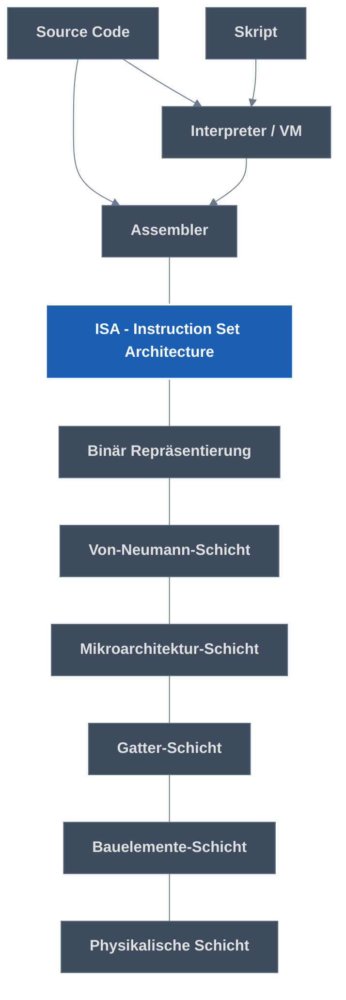

#era
#orga
**Workflow:**
- Vorlesung/Moodle -> reine Gliederung (Obsidian)
- Bjarne(the goat)-Slides -> Handnotizen
- ZÜ-Quizzes
- Handnotizen, Bjarne-Tipps -> Obsidian
- Tutoriumsaufgaben/Altklausur
# 1. Einführung und Datenrepräsentation Datei
## Datendarstellungen
- Grundlage: Relais (Stromkreis durch separaten Strom an/aus öffnen schließen)
- Transistor (selbe Funktionsweise, aber nur 3 Kontakte also 1 Stromkreis)
### Binär
- "Word" = Basisgröße des Systems (`16 bit`, `32 bit`, etc.)
	- wir benutzen `32 bit`
- Negative Zahlen via Zweierkomplement (Rechnung leichter)
	- Invertierung, + 1
	- Wertebereich $[2^{n-1},2^{n-1}-1]$ -> positiver Bereich eins kleiner, dafür $0$ dabei
- Kommazahlen via
	- Tupel aus 2 Zahlen (vor und nach Komma)
	- Floating Point Numbers
		- **S**: Vorzeichen
		- **F**: Nachkommastellen nach 1 (Fraction, Koeffizient, Mantisse, Significant)
		- **E**: Verschiebung des Kommas (Abzüglich Bias)
		- ($Mantisse\cdot basis^{Exponent}$[^1])
- Strings via **Ascii** (so 8 bit Zahl <-> Buchstabe halt)
	- *C-String*
		- endet mit dem Byte `0x0` (**null-terminiert**)
		- in RV-Assembly mit `.asciz`
		- Soweit ich weiß bei uns eher default
	- *Pascal String*
		- beginnt mit Zahl als Länge
		- "Der Pascal sagt dir gleich was Sache ist"
## Abstraktionsebenen
**Vorteil**: Verschiedene Versionen jeder Ebene mit jeweils anderen Ebenen kompatibel

# 2. Assemblersprachen Allgemein
## C-Kompilierung
`gcc` - C Code -> Kompilierung auf ausführbare Binärdatei
	`-s`: Erzeugt Zwischenergebnis (Assemblersprache)
`hexdump` - Inhalt der Binärdatei in Hex ausgeben
`objdump` 
	``-h``: teilt in sections ein
	`-d`: Disassemblierung (Binär -> Assemblersprache)
	`-S`: Codiertes Programm mit Bezug auf Quellcode

## ISA
> [!NOTE] ISA
> Instruction Set Architectures
> Assemblersprache, Datenkodierungen, Systemeigenschaften, Boot-Up-Prozess
### Komplexität

|          | CISC                                         | RISC                                 |
| -------- | -------------------------------------------- | ------------------------------------ |
| Vorteil  | einfach programmierbar                       | effiziente, schnelle Implementierung |
| Nachteil | langsame Implementierung, ungenutztes        | schwer programmierbar                |
| Format   | variabel (mehrere Formate für selben Befehl) | einheitlich                          |
# 2,5. RISC-V
## Befehlsklassen
### arithmetische und logische Operationen
#### Addition/Subtraktion
`add`/`sub` `Ziel, Quelle1, Quelle2`
`addi Ziel Quelle1, Konst` <- max 12 bits
`lui` lädt obere 20 bits (zusammen mit `addi` laden von 32 bits)
#### Multiplikation/Division (nur mit `M`-Erweiterung)
`mul` multipliziert untere 32 bit
`mulh` multiply high (multipliziert obere) **signed \* signed**
	...`su` signed * unsigned
	...`u` unsigned * unsigned
`div` Division abgerundet
`rem` Rest
	...`u` unsigned
#### Logische Operationen (bitwise)
`and`,`or`,`xor`
Für jeden Bit der beiden Zahlen
#### Schiebebefehle
Basically wie Multiplikation/Division, manchmal
`sll` shift left logical (um drittes argument, aber nur letzte 5 bits), füllt mit 0 auf
	...`i` intermediate (direkt mit supplied 5 bit Zahl)
`sr` shift right... (zwei Möglichkeit)
	...`l` logical (füllt mit 0 auf)
	...`a` arithmetic (füllt mit 0 auf, aber behält aller ersten bit aka Vorzeichen)
#### Floating Point Arithmetik
Floats mit `F`-Erweiterung
Doubles mit `D`-Erweiterung
Eigene Register
`fadd`,`fsub`
	...`d`
#### Datentransfer
Daten aus dem Hauptspeicher (Arbeitsspeicher) laden
`ld` load double word (64 bit)
`sd` store double word
`ld destination const(Basisadresse)`
Lädt in `destination` Adresse: Wert von`Basisadresse` + `const`
#### Steuerung des Programmlaufs
#### Unbedingter Sprung
`j offset` Springe zu aktuell + `offset`
`jr reg, const` Springe zu Wert von `reg` + `imm`
Beim selbst Schreiben: Sprungmarken
#### Bedingter Sprung
`bxx Operand1, Operand2, offset` Springe um `offset` wenn Bedingung true
`beq`, `bne`, `blt`, `bge`
Andere Richtungen der letzten beiden via Tausch der Operanden
#### Unterprogramm
`jal reg, offset` Jump and link, Springe um `offset`, Speicher Adresse nächsten Befehls in `reg`

+Systembefehle `ecall`, Eskaliert vom [^3]
+Input/Output

> [!warning] Keine 1:1-Beziehung von Opcode und Befehl
> Pseudobefehle, z.B.
> `mv rd, rs` = `add rd, rs, x0`
> `j offset` = `jal x0, offset`
> `li rd, i` = 1.`lui rd, i[31:12]` 2.`addi rd, rd, i[11:0]`
> 	-> **==Wenn `i[11]`=`1`, müssen wir `lui rd,i[31:12]+1` machen, da `addi` das `i[11:0]` dann als negativ interpretiert und das [[#Sign-Extension|Zweier-Komplement]] der Zahl vom Upper Immediate abzieht!==**
## Speicher
### Register
`x0`: zero
x1-x31:
	`an`: Argument/Return
	`sn`: saved ([[#Caller-/Callee-Saved|by callee]])
	`tn`: temporary
	`ra`: return adress
	`sp`: stack pointer (also [[#Caller-/Callee-Saved|callee-saved]])
### Hauptspeicher (Arbeitsspeicher)
Speicherzellen mit Größe entsprechend ISA
**Byte-Adressiert** (wir können nur ganze Bytes adressieren):

| Adresse | Daten in Speicher |
| ------- | ----------------- |
| 1 bit   | 1 byte = 8 bits   |

#### Data alignment
Ausrichtung auf n-Byte-Grenze: jede Adresse mod n = 0
Bei **RISC-V** ist der **Stack** `16 byte` aligned
#### Endianness

| Little Endian                                                                                                             | Big Endian                                                                                                            |
| ------------------------------------------------------------------------------------------------------------------------- | --------------------------------------------------------------------------------------------------------------------- |
| least-significant Stelle ("kleines Ende") auf niedrigster Adresse                                                      | most-significant Stelle ("großes Ende") auf niedrigster Adresse                                                    |
| `0xABCD1234` im Speicher als **\|==34==\|12\|CD\|AB\|** (**==34==** hat hier Wertigkeit $16^1$/$16^{0}$, die kleinste) | `0xABCD1234` im Speicher als **\|==AB==\|CD\|12\|34\|** (**==AB==** hat hier Wertigkeit $16^7$/$16^6$, die größte) |
| Erlaubt dynamische Größe (**casting**) des Werts ohne Verschieben des Pointers                                            | Intuitiver für Menschen, um Zahlen im Speicher zu lesen                                                               |
in RISC-V Wechselmöglichkeit, aber wir nutzen **Little Endian**

#### Aufbau
![[era03-beispiel.pdf#page=12&rect=663,34,844,436|era03-beispiel, p.12|250]]
- Stack
	- meist für Zwischenergebnisse verwendet
	- meist kleiner als der Heap
	- wächst meist nach unten (-> Erweitern durch **Dekrementierung(!)** des SP)
	- recht einfach zu verwalten (LIFO)
	- [[#Data alignment|16 byte aligned]]
- Heap
	- meist für dynamische Datenstrukturen verwendet
	- meist größer als der Stack
	- wächst meist nach oben
	- schwerer zu verwalten (Dynamisch)
- Static Data hat z.B. Konstanten wie verwendete Strings
- Text ist der Programmcode
  
[[#Virtueller Speicher (Paging/Mehrere Adressräume)|Jedes Programm erhält eigenen Adressraum (für genutzte Daten und Programm selbst)]]

### Sign-Extension
Jede Zahl, die mit `1` beginnt (aka in Hex mit >=`8` beginnt), ist im [[#Binär|Zweier-Komplement]] negativ. Wenn wir diesen Zahlen mehr Stellen geben wollen ("größer casten"), gibt es eine wichtige Sache zu beachten: Der Default-Wert für "leere Stellen", die neu hinzukommen, ist bei negativen Zahlen nicht `0`, sondern `1`. Also füllt man mit `1`en auf, wenn bspw. ein `12-bit` Immediate auf ein `32-bit` Register addiert werden soll.

| `12 bits`           | *Sign-Extended* auf `32 bits`                |
| ------------------- | -------------------------------------------- |
| `0b 0100 0110 1110` | `0b 0000 0000 0000 0000 0000 0100 0110 1110` |
| `0b 1100 0110 1110` | `0b 1111 1111 1111 1111 1111 1100 0110 1110` |

## Calling Convention
### Argumente/Return
#### Einzelnes Argument

| Größe                | Passed als                                                     |
| -------------------- | -------------------------------------------------------------- |
| `<32 bits`           | [[#Sign-Extension\|Sign-Extended]] auf `32 bits` -> 1 Register |
| `32 bits / 1 word`   | 1 Register                                                     |
| `64 bit / 2 words`   | 2 Register ([[#Endianness\|lower half zuerst]])                |
| `>64 bit / >2 words` | Referenz                                                       |
#### Argumente insgesamt

| Größe       | Passed in |
| ----------- | --------- |
| `1-8 words` | Registern |
| `>8 words`  | Stack     |
#### Return
| Größe                | Returned via                   |
| -------------------- | ------------------------------ |
| `32 bits / 1 word`   | `a0`                           |
| `64 bit / 2 words`   | `a0` und `a1`                  |
| `>64 bit / >2 words` | in `a0` referenzierter Adresse |

> [!info] zu "in `a0` referenzierter Adresse"
> - Diese Adresse muss also der Caller der Funktion schon mitgeben.
> - Die tatsächlichen Argumente darf er dann erst ab `a1` angeben.
> - Meist handelt es sich bei der Adresse in `a0` um eine innerhalb des Stack-Frames des Callers, so weit Bjarne weiß sogar immer ganz oben (also bei `0(sp)`).

### Caller-/Callee-Saved

| Caller-saved                | Callee-saved                                                             |
| --------------------------- | ------------------------------------------------------------------------ |
| musst selber Wert speichern | aufgerufene Funktion darf Wert nicht verändern/muss ihn wiederherstellen |

## Aufbau Programm/Routine
- Prologue
	- Platz auf Stack reservieren (SP **dekrementieren(!)**)
	- Return Address und andere Variablen auf dem Stack sichern
- Tatsächlicher Stuff
- Epilogue
	- Return Address etc. wieder vom Stack holen
	- Platz auf Stack freigeben (SP **inkrementieren(!)**)
[^4]
# 3. Architekturen
## Von-Neumann-Architektur
1. Struktur des Rechners unabhängig von bearbeitetem Problem
2. Rechner besteht aus vier Werken (die mit Bus-System verbunden sind):
   *Speicherwerk* (RAM)
   *Leitwerk* (CPU)
   *Rechenwerk* (CPU)
   *Ein-/Ausgabewerk* inkl. Sekundärspeicher (Peripherieanschluss, Festplatte)
3. Hauptspeicher hat Zellen gleiche Größe mit Adressen
4. Programm & Daten stehen in selbem Speicher und können durch die Maschine verändert werden
5. Die Maschine nutzt Binär
6. Programm besteht aus Folge von Befehlen
7. Von der Folge kann durch Sprünge abgewichen werden
   Unterprogrammaufrufe:
	   1. Register sichern, Parameter supplien
	   2. Springen (Jump and Link)
	   3. Operation
	   4. Zurückspringen (Jump and Link)
## Harvard-Architektur
Unterschied z.B.: Getrennter Speicher für Daten und Programm

> [!quote] inshallah das kommt in der klausur dran

# 4.A Andere ISAs

# 4.B Systemarchitektur
## Mehrbenutzersysteme
### Privilegienstufen
- **M**achine Mode
	- Babo Modus
	- [[#Systemaufruf]] führt kurz hier hin, dann meist Mapping zu S-Mode
- **S**upervisor Mode ("Kernel-Level")
	- Hier landen wir meist nach [[#Systemaufruf]]
	- Zugriff auf z.B. Hardware möglich
- **U**ser Mode
	- hier sind wir normalerweise
	- mit [[#Systemaufruf]] können wir aber raus
### Systemaufruf
in RISC-V mit `ecall`

## Interrupts vs. Traps/Exceptions
![[Pasted image 20251104173149.png|500]]

> [!quote] shoutout an schulz's roten stift, you won't be missed

# 5. Speicherverwaltung & Caches
## Virtueller Speicher (Paging/Mehrere Adressräume)
Jedes Programm hat eigenen Speicherraum mit virtuellen Adressen, und nur innerhalb dieses Adressraums Zugriff
Virtuelle Adresse wird immer auf physische übersetzt von MMU (früher Hardware) via Seiten-Kachel-Tabelle ([[#Herausforderungen und Einsatz von Virtuellem Speicher|auch mehrere Ebenen möglich]])
4KiB Kacheln abgebildet auf 4KiB Kacheln (heutzutage auch größere möglich)
Nur Teil des Adressraums jedes Programms ist tatsächlich im Speicher angelegt, bei Bedarf wird erweitert
Was wenn Programm zugeschriebener Speicher nicht erfüllt werden kann weil keine Kacheln verfügbar? Freimachen beliebiger ( idealerweise lange ungenutzter) Kachel durch Auslagern auf Hintergrundspeicher/Festplatte
## Herausforderungen und Einsatz von Virtuellem Speicher
Realisierung?
*Naiv*: 1 zusammenhängende Page Table mit komplettem Mapping
	-> schneller Zugriff, aber giga Platzbedarf
	man müsste ja 1 zusammenhängenden Platz für alle mappings aller Speicherräume reservieren
*Based und Sigma*: Ebenen mit Tables gemäß Teilen der Adresse
	-> viel weniger Platzbedarf
	-> aber auch langsamer
		(weil nicht $1$ Zugriff sondern immer $n_{Ebenen}$ Zugriffe)
		-> Allerdings in der Praxis TLB (Cache für Mapping -> weniger Zugriffe)
## Cache
Idealerweise enthält ein möglichst kleiner Zwischenspeicher die als nächstes benötigten Daten, damit schneller auf sie zugegriffen werden kann.
Aber was wird als nächstes benötigt?
1. *zeitliches Lokalitätsprinzip*: vor kurzem verwendete Daten
2. *räumliches Lokalitätsprinzip*: benachbarte Daten zu zuvor verwendeten

Wie geht dann Schreiben? 2 Möglichkeiten:
1. Schreiben in den Cache (bei Löschen aus Cache auch Hauptspeicher updaten)
2. Schreiben in den Hauptspeicher (bei Lesen aus Cache neu aus Hauptspeicher holen)

Was wird wo im Cache gespeichert?
Einteilung Speicheradresse in

| Tag                                     | Index                | Offset                  |
| --------------------------------------- | -------------------- | ----------------------- |
| Alias von Zeile                         | ID von Speichermenge | innerhalb von Zeile     |
| $bits_{ges}-bits_{index}-bits_{offset}$ | $\log_{2}(n_{Sets})$ | $\log_{2}(Zeilenlänge)$ |
$$assozitivität = \frac{n_{Zeilen}}{n_{Sets}}$$
## Cache-Kohärenz
**Problem**:
- Prozessor A liest Wert mit Adresse 1 aus Hauptspeicher und legt ihn in seinen Cache
- Prozessor B schreibt auf Adresse 1 im Hauptspeicher
-> Prozessor A hat falschen Wert im Cache!
**Lösung**:*MESI-Protokoll*
Jeder Prozessor merkt sich für jede Adresse, die er im Cache hat, einen der folgenden Zustände
- Exclusive:
	- ==Nur ich== habe diese Adresse im Cache
	- mein Wert im Cache ist *==valid==* (entspricht dem Hauptspeicher)
- Shared:
	- ==Auch andere== haben diese Adresse im Cache
	- mein Wert im Cache ist *==valid==*
- Modified:
	- ==Auch andere== haben diese Adresse im Cache
	- mein (neuer, von mir modifizierter) Wert im Cache ist *==valid==*
	- andere haben noch den alten, **==invalid==** Wert
- Invalid:
	- ==Auch andere== haben diese Adresse im Cache
	- in meinem Cache ist ein veralteter, **==invalid==** Wert
	- ich muss mir beim nächsten Zugriff den neuen *==valid==* aus dem Hauptspeicher holen
### Spezialfälle
#### Direct Mapped
$assoziativität=1$ -> $n_{Zeilen}=n_{Sets}$
Pro Index-Bit Belegung existiert nur 1 Zeile (das zugehörige Set hat nur 1 Zeile)
-> Es kann nur maximal eine Hauptspeicherzeile mit dieser Belegung im Cache sein
-> [[#Conflict Miss|Conflict-Miss]]-City (passieren dauernd)
#### Voll-Assoziativ
$assoziativität = n_{Zeilen}$ -> $n_{Sets}=1$
Es gibt nur ein einziges Set, wo jede Hauptspeicherzeile whereever hin kann, weil sie mit ihrem Tag identifiziert wird.
-> Es kann keine [[#Conflict Miss]]es geben
### Misses
**Generell**: Gesuchte Zeile ist momentan nicht im Cache und muss aus dem Hauptspeicher geholt werden (-> delay)
#### Cold Miss
Gesuchte Zeile war noch nie im Cache, also muss sie obv aus dem Hauptspeicher geholt werden.
#### Conflict Miss
Gesuchte Zeile war mal im Cache. Aber sie wurde von anderer Zeile vertrieben, und das obwohl es damals in anderen Sets noch Platz gegeben hätte. Also wäre das in einem [[#Voll-Assoziativ|voll-assoziativen]] Cache nicht passiert.
#### Capacity Miss
Gesuchte Zeile war mal im Cache. Aber sie wurde von anderer Zeile vertrieben, und es wäre auch nirgends sonst noch Platz gewesen. Also wäre das in einem [[#Voll-Assoziativ|voll-assoziativen]] Cache auch passiert.
### Memory Access Time
$$AvgMemoryAccessTime = HitRate \cdot HitLatency + MissRate \cdot MissLatency$$
$$HitRate + MissRate = \frac{Hits}{TotalAccesses} + \frac{Misses}{TotalAccesses} = 1$$
## Speicherhierarchie
*==Hauptspeicher==* -> *L1* -> *L2* -> *L3*
**Inklusiv**: Alle Daten aus Layer auch in untergeordneten
oder
**Exklusiv**: Gegenteil, jedes Datum nur in einem Layer
# 6.A Boolesche Algebra
easy clap tbh
## Aussagenlogik
**Dualer Ausdruck**: $F^D$, sozusagen das Gegenteil eines Ausdrucks
	Bilden mit: $1:=0$, $0:=1$, $\vee:=\wedge$, $\wedge:=\vee$
## Wahrheitstabellen
## Boolesche Algebra
## Boolesche Ausdrücke

# 6.B +/-[^2] (Addierer & Subtrahierer)
## Beschreibung von Schaltungen
## Multiplexer
Basically switch case, 1 Entscheidungseingang und lauter nummerierte Eingänge, von denen der Entscheidungseingang einen aussucht.
==In Klausur immer die Nummerierung der Eingänge hinschreiben!==
## Addierer
## Subtrahierer
# 7.A * (Multiplizierer)
## Paralleler Multiplizierer
## Multiplizierer mit Carry-Save-Addierer
## ALU
# 7.B Speichern
## Sequenzielle Schaltungen
## RS-Latch
## D-Latch
Latch -> "latched" onto E (meist Clock), bei E=1 wird D "geschrieben", sonst behält es den letzten valid Zustand
## D-FlipFlop
FlipFlop -> "schreibt" nur exakt beim Wechsel von E (meist Clock) von 0 auf 1 (bzw. 1 auf 0), sonst behält es den letzten valid Zustand.
## Schieberegister
## Speicher
# Single-Cycle
## Decode

| Name              | Bits      | Verwendung                            |
| ----------------- | --------- | ------------------------------------- |
| op                | 7         | Instruktionsformat (für Main Decoder) |
| func-3 und func-7 | 3 und 7   | ALU-Operation (mit Opcode)            |
| rd                | 5         | register destination                  |
| rs1 und rs2       | 5 und 5   | register source                       |
| imm               | $\geq$ 12 | Immediate                             |

## ?
### Logic Hazards
# BDD (Binary Decision Diagram)
## Reduktionen
*S-Reduktion*
	stupid Knoten, der mit allem auf anderen zeigt, kann weg
*I-Reduktion*
	isomorphe Knoten, die sich gleich verhalten, kann man kombinieren
## Shannon-Transformation
**Funktion**: ==Formel -> [[#BDD (Binary Decision Diagram)|BDD]]==
Wir nehmen immer die entsprechend der Variablenordnung kleinste Variable und erzeugen zwei neue Branches, für die beiden Belegungen der Variable. Auf die neuen Knoten schreiben wir die neue Formel (mit belegter Variable). Das machen wir so lange bis es keine Variablen mehr gibt. Dann nur noch [[#Reduktionen]] benutzen, um zu "kürzen". Fertig ist der Baum!
## ITE-Verfahren
> [!danger] Hat NICHTS mit ITE-Operator an sich zu tun
> Idk wer sich dachte, dass man das so nennen soll. Nicht verwirren lassen, wenn man mit dem ITE-Verfahren 3 Bäume mit dem ITE-Operator kombinieren soll.

**Funktion**: ==[[#BDD (Binary Decision Diagram)|BDDs]] kombinieren mithilfe beliebiges Operators==
- Jeden Knoten unique benennen
- Wir starten bei jedem Baum mit dem jeweils obersten Knoten
- Loop (solang bis der Wert der Formel feststeht)
	- Neuen Knoten unseres neuen Baums erstellen
		- Mit zugehöriger Formel (Operator auf Knoten der Bäume angewendet)
		- Wenn es den Knoten mit der Formel schon gibt, können wir ihn wiederverwenden!
	- Bei niedrigste(n) Variablen (gemäß Ordnung) eins runtergehen, um nächste Knoten zu finden
- Wenn wir einen festen Wert haben, verweist die entsprechende Kante einfach auf 1 oder 0
- Dann gehen wir im zu erstellenden Baum so lange hoch, bis ein Pfad fehlt und wieder Loop
- [[#Reduktionen]] benutzen, um Baum zu "kürzen"
## Tseitsin-Transformation
**Funktion**: ==Schaltungen auf Äquivalenz Prüfen==
- $F = Schaltung1 \oplus Schaltung2$
- wenn $F$ erfüllbar ist (also wenn es $\geq 1$ Belegung gibt wo True rauskommt), sind die Schaltungen nicht Äquivalent!
-> Um das zu testen, kann man $F$ noch in KNF überführen.Dafür
- erstellt man den Syntax-Baum (mit der $Schaltung$ direkt geht eigentlich auch)
- benennt jede Abzweigung mit einer Variable $a_{n}$
- formuliert $F \wedge (F \leftrightarrow a_{0}) \wedge (a_{0} \leftrightarrow \dots) \wedge \dots$
- Das kann man dann noch in KNF auflösen:
  $A\leftrightarrow B$
  $\equiv (A\to B)\wedge(B\to A)$
  $\equiv (\neg A \vee B)\wedge(\neg B\vee A)$
  (ggf. *deMorgan* anwenden)

# Steinerbaum
- verbindet alle Terminale in
- zusammenhängendem Graphen
## Erstellen
1. Hanaan-Punkte finden
   alle die auf Spalte und Zeile von Terminalen liegen
2. Kürzesten Pfad zwischen zwei Terminalen finden
3. auf den beiden Möglichkeiten verbinden (links und rechtsrum)
4. Alle Hanaan-Punkte auf diesen Verbindungen markieren
5. Kürzesten Pfad zwischen Hanaan-Punkt und nächstem Terminal finden (-> 3.)
-> Wenn alle verbunden sind, sind wir fertig yay!
## Optimierter Steinerbaum
Nur weil wir einen Steinerbaum haben, hat der noch nicht die minimalen Kosten. Dabei handelt es sich dann um ein (NP-hartes) [[#MILP aka Multiple Integer Linear Programming (nicht so easy (NP-hart))|MILP-Problem]]

# LP und MILP
## LP aka Linear Programming (easy)
Unter Beachtung linearer Bedingungen (z.B. $x_{1}+x_{2}>4$) möglichst kleinen Wert für eine Formel $f(x_{1},\dots x_{n})$ finden. Meist sind einige Variablen der Lösung nicht ganzzahlig.
## MILP aka Multiple Integer Linear Programming (nicht so easy (NP-hart))
Wie [[#LP aka Linear Programming (easy)|LP]] aber zudem muss eine bestimmte Teilmenge der Variablen ganzzahlig sein.
1. [[#LP aka Linear Programming (easy)|LP]]-Lösung finden
2. ist sie auch MILP-Lösung?
	- ja -> perfekt, nächste Lösung finden (-> 1.)
	- nein -> Werte "runden"
		- indem wir für jeden zu rundenden Wert $x_{p}$ zwei neue LP-Bedingungen adden
		- und zwar $x_{p}\geq upperBound$ und $x_{p}\leq lowerBound$
		- So schließen wir den nicht-ganzzahligen Problembereich für diesen Wert quasi aus
		- dann mit neuen Bedingungen dabei von vorne (-> 1.)
3. Sobald wir alle MILP-Lösungen haben, die mit minimalen Kosten nehmen!

---
# Fußnoten

[^1]: TODO Was ist Bias?
[^2]: Das Wirtschaftsmagazin
