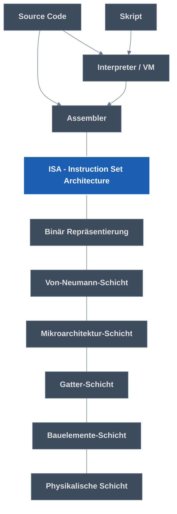

#era
#orga 
**Workflow:**
- Vorlesung/Moodle -> reine Gliederung (Obsidian)
- Bjarne-Slides -> Handnotizen
- ZÜ-Quizzes
- Handnotizen, Bjarne-Tipps -> Obsidian
- Tutoriumsaufgaben/Altklausur
# 1. Einführung und Datenrepräsentation Datei
## Datendarstellungen
- Grundlage: Relais (Stromkreis durch separaten Strom an/aus öffnen schließen)
- Transistor (selbe Funktionsweise, aber nur 3 Kontakte also 1 Stromkreis)
### Binär
- "Word" Basisgröße des Systems (`16 bit`, `32 bit`, etc.)
	- wir benutzen `32 bit`
- Negative Zahlen via Zweierkomplement (Rechnung leichter)
	- Invertierung, + 1
	- Wertebereich $[-1^{n-1},2^{n-1}-1]$
- Kommazahlen via
	- Tupel aus 2 Zahlen (vor und nach Komma)
	- Floating Point Numbers
		- **S**: Vorzeichen
		- **F**: Nachkommastellen nach 1 (Fraction, Koeffizient, Mantisse, Significant)
		- **E**: Verschiebung des Kommas (Abzüglich Bias)
		- ($Mantisse\cdot basis^{Exponent}$[^2])
- Strings via **Ascii** (so 8 bit Zahl <-> Buchstabe halt)
	- *C-String*
		- endet mit dem Byte `0x0` (**null-terminiert**)
		- in RV-Assembly mit `.asciz`
		- Soweit ich weiß bei uns eher default
	- *Pascal String*
		- beginnt mit Zahl als Länge
		- "Der Pascal sagt dir gleich was Sache ist"
## Abstraktionsebenen
**Vorteil**: Verschiedene Versionen jeder Ebene mit jeweils anderen Ebenen kompatibel

# 2. Assemblersprachen Allgemein
## C-Kompilierung
`gcc` - C Code -> Kompilierung auf ausführbare Binärdatei
	`-s`: Erzeugt Zwischenergebnis (Assemblersprache)
`hexdump` - Inhalt der Binärdatei in Hex ausgeben
`objdump` 
	``-h``: teilt in sections ein
	`-d`: Disassemblierung (Binär -> Assemblersprache)
	`-S`: Codiertes Programm mit Bezug auf Quellcode

## ISA
> [!NOTE] ISA
> Instruction Set Architectures
> Assemblersprache, Datenkodierungen, Systemeigenschaften, Boot-Up-Prozess
### Komplexität

|          | CISC                                         | RISC                                 |
| -------- | -------------------------------------------- | ------------------------------------ |
| Vorteil  | einfach programmierbar                       | effiziente, schnelle Implementierung |
| Nachteil | langsame Implementierung, ungenutztes        | schwer programmierbar                |
| Format   | variabel (mehrere Formate für selben Befehl) | einheitlich                          |
# 2,5. RISC-V
## Befehlsklassen
### arithmetische und logische Operationen
#### Addition/Subtraktion
`add`/`sub` `Ziel, Quelle1, Quelle2`
`addi Ziel Quelle1, Konst` <- max 12 bits
`lui` lädt obere 20 bits (zusammen mit `addi` laden von 32 bits)
#### Multiplikation/Division (nur mit `M`-Erweiterung)
`mul` multipliziert untere 32 bit
`mulh` multiply high (multipliziert obere) **signed \* signed**
	...`su` signed * unsigned
	...`u` unsigned * unsigned
`div` Division abgerundet
`rem` Rest
	...`u` unsigned
#### Logische Operationen (bitwise)
`and`,`or`,`xor`
Für jeden Bit der beiden Zahlen
#### Schiebebefehle
Basically wie Multiplikation/Division, manchmal
`sll` shift left logical (um drittes argument, aber nur letzte 5 bits), füllt mit 0 auf
	...`i` intermediate (direkt mit supplied 5 bit Zahl)
`sr` shift right... (zwei Möglichkeit)
	...`l` logical (füllt mit 0 auf)
	...`a` arithmetic (füllt mit 0 auf, aber behält aller ersten bit aka Vorzeichen)
#### Floating Point Arithmetik
Floats mit `F`-Erweiterung
Doubles mit `D`-Erweiterung
Eigene Register
`fadd`,`fsub`
	...`d`
#### Datentransfer
Daten aus dem Hauptspeicher (Arbeitsspeicher) laden
`ld` load double word (64 bit)
`sd` store double word
`ld destination const(Basisadresse)`
Lädt in `destination` Adresse: Wert von`Basisadresse` + `const`
#### Steuerung des Programmlaufs
#### Unbedingter Sprung
`j offset` Springe zu aktuell + `offset`
`jr reg, const` Springe zu Wert von `reg` + `imm`
Beim selbst Schreiben: Sprungmarken
#### Bedingter Sprung
`bxx Operand1, Operand2, offset` Springe um `offset` wenn Bedingung true
`beq`, `bne`, `blt`, `bge`
Andere Richtungen der letzten beiden via Tausch der Operanden
#### Unterprogramm
`jal reg, offset` Jump and link, Springe um `offset`, Speicher Adresse nächsten Befehls in `reg`

+Systembefehle `ecall`, Eskaliert vom [^3]
+Input/Output

> [!warning] Keine 1:1-Beziehung von Opcode und Befehl
> Pseudobefehle, z.B.
> `mv ra, rb` = `add ra, rb, x0`
> `j offset` = `jal x0, offset`
> `li ra, i` = ``
## Speicher
### Register
`x0`: zero
x1-x31:
	`an`: Argument/Return
	`sn`: saved ([[#Caller-/Callee-Saved|by callee]])
	`tn`: temporary
	`ra`: return adress
	`sp`: stack pointer (also [[#Caller-/Callee-Saved|callee-saved]])
### Hauptspeicher (Arbeitsspeicher)
Speicherzellen mit Größe entsprechend ISA
Adresse pro Byte (8 bits)
#### Data alignment
Ausrichtung auf n-Byte-Grenze: jede Adresse mod n = 0
Bei **RISC-V** ist der **Stack** `16 byte` aligned
#### Endianness

| Little Endian                                                                                                             | Big Endian                                                                                                            |
| ------------------------------------------------------------------------------------------------------------------------- | --------------------------------------------------------------------------------------------------------------------- |
| least-significant Stelle ("kleines Ende") auf niedrigster Adresse                                                      | most-significant Stelle ("großes Ende") auf niedrigster Adresse                                                    |
| `0xABCD1234` im Speicher als **\|==34==\|12\|CD\|AB\|** (**==34==** hat hier Wertigkeit $16^1$/$16^{0}$, die kleinste) | `0xABCD1234` im Speicher als **\|==AB==\|CD\|12\|34\|** (**==AB==** hat hier Wertigkeit $16^7$/$16^6$, die größte) |
| Erlaubt dynamische Größe (**casting**) des Werts ohne Verschieben des Pointers                                            | Intuitiver für Menschen, um Zahlen im Speicher zu lesen                                                               |
in RISC-V Wechselmöglichkeit, aber wir nutzen **Little Endian**

#### Aufbau
![[era03-beispiel.pdf#page=12&rect=663,34,844,436|era03-beispiel, p.12|250]]
- Stack
	- meist für Zwischenergebnisse verwendet
	- meist größer als der Heap
	- wächst meist nach unten (-> Erweitern durch **Dekrementierung(!)** des SP)
	- recht einfach zu verwalten (LIFO)
	- [[#Data alignment|16 byte aligned]]
- Heap
	- meist für dynamische Datenstrukturen verwendet
	- meist kleiner als der Stack
	- wächst meist nach oben
	- schwerer zu verwalten (Dynamisch)
- Static Data hat z.B. Konstanten wie verwendete Strings
- Text ist der Programmcode
  
[[#Virtueller Speicher (Mehrere Adressräume)|Jedes Programm erhält eigenen Adressraum (für genutzte Daten und Programm selbst)]]

### Sign-Extension
TODO
## Calling Convention
### Argumente/Return
#### Einzelnes Argument

| Größe                | Passed als                                                   |
| -------------------- | ------------------------------------------------------------ |
| `<32 bits`           | [[#Sign-Extension\|Sign-Extended]] zu 1 Register (`32 bits`) |
| `32 bits / 1 word`   | 1 Register                                                   |
| `64 bit / 2 words`   | 2 Register ([[#Endianness\|lower half zuerst]])              |
| `>64 bit / >2 words` | Referenz                                                     |
#### Argumente insgesamt

| Größe       | Passed in |
| ----------- | --------- |
| `1-8 words` | Registern |
| `>8 words`  | Stack     |
#### Return
| Größe                | Returned via                   |
| -------------------- | ------------------------------ |
| `32 bits / 1 word`   | `a0`                           |
| `64 bit / 2 words`   | `a0` und `a1`                  |
| `>64 bit / >2 words` | in `a0` referenzierter Adresse |

> [!info] zu "in `a0` referenzierter Adresse"
> - Diese Adresse muss also der Caller der Funktion schon mitgeben.
> - Die tatsächlichen Argumente darf er dann erst ab `a1` angeben.
> - Meist handelt es sich bei der Adresse in `a0` um eine innerhalb des Stack-Frames des Callers, so weit Bjarne weiß sogar immer ganz oben (also bei `0(sp)`).

### Caller-/Callee-Saved

| Caller-saved                | Callee-saved                                                             |
| --------------------------- | ------------------------------------------------------------------------ |
| musst selber Wert speichern | aufgerufene Funktion darf Wert nicht verändern/muss ihn wiederherstellen |

## Aufbau Programm/Routine
- Prologue
	- Platz auf Stack reservieren (SP **dekrementieren(!)**)
	- Return Address und andere Variablen auf dem Stack sichern
- Tatsächlicher Stuff
- Epilogue
	- Return Address etc. wieder vom Stack holen
	- Platz auf Stack freigeben (SP **inkrementieren(!)**)
[^4]
# 3. Architekturen
## Von-Neumann-Architektur
1. Struktur des Rechners unabhängig von bearbeitetem Problem
2. Rechner besteht aus vier Werken:
   Hauptspeicher (RAM)
   Leitwerk (CPU)
   Rechenwerk (CPU)
   Ein-/Ausgabewerk inkl. Sekundärspeicher (Peripherieanschluss, Festplatte)
3. Hauptspeicher hat Zellen gleiche Größe mit Adressen
4. Programm & Daten stehen in selbem Speicher und können durch die Maschine verändert werden
5. Die Maschine nutzt Binär
6. Programm besteht aus Folge von Befehlen
7. Von der Folge kann durch Sprünge abgewichen werden
   Unterprogrammaufrufe:
	   1. Register sichern, Parameter supplien
	   2. Springen (Jump and Link)
	   3. Operation
	   4. Zurückspringen (Jump and Link)
## Harvard-Architektur
Unterschied z.B.: Getrennter Speicher für Daten und Programm

> [!quote] inshallah das kommt in der klausur dran

# 4.A Andere ISAs

# 4.B Systemarchitektur
## Mehrbenutzersysteme?[^5]
## Interrupts vs. Traps/Exceptions
![[Pasted image 20251104173149.png|500]]

> [!quote] shoutout an schulz's roten stift, you won't be missed

# 5. Speicherverwaltung & Caches
## Virtueller Speicher (Mehrere Adressräume)
Jedes Programm hat eigenen Speicherraum mit virtuellen Adressen, und nur innerhalb dieses Adressraums Zugriff
Virtuelle Adresse wird immer auf physische übersetzt von MMU (früher Hardware) via Seiten-Kachel-Tabelle (auch mehrere Ebenen möglich)
4KiB Kacheln abgebildet auf 4KiB Kacheln (heutzutage auch größere möglich)
Nur Teil des Adressraums jedes Programms ist tatsächlich im Speicher angelegt, bei Bedarf wird erweitert
Was wenn Programm zugeschriebener Speicher nicht erfüllt werden kann weil keine Kacheln verfügbar? Freimachen beliebiger ( idealerweise lange ungenutzter) Kachel durch Auslagern auf Hintergrundspeicher/Festplatte
## Herausforderungen und Einsatz von Virtuellem Speicher
## Cache
Idealerweise enthält ein möglichst kleiner Zwischenspeicher die als nächstes benötigten Daten, damit schneller auf sie zugegriffen werden kann.
Aber was wird als nächstes benötigt?
1. *zeitliches Lokalitätsprinzip*: vor kurzem verwendete Daten
2. *räumliches Lokalitätsprinzip*: benachbarte Daten zu zuvor verwendeten

Wie geht dann Schreiben? 2 Möglichkeiten:
1. Schreiben in den Cache (bei Löschen aus Cache auch Hauptspeicher updaten)
2. Schreiben in den Hauptspeicher (bei Lesen aus Cache neu aus Hauptspeicher holen)

Was wird wo im Cache gespeichert?
Einteilung Speicheradresse in

| Tag             | Index                | Offset              |
| --------------- | -------------------- | ------------------- |
| Alias von Zeile | ID von Speichermenge | innerhalb von Zeile |

TODO fertig machen
## Bsiepiel
## Speicherhierarchie
# 6.A Boolesche Algebra
## Aussagenlogik
## Wahrheitstabellen
## Boolesche Algebra
## Boolesche Ausdrücke

# 6.B +/-[^1] (Addierer & Subtrahierer)
## Beschreibung von Schaltungen
## Multiplexer
## Addierer
## Subtrahierer
# 7.A * (Multiplizierer)
## Paralleler Multiplizierer
## Multiplizierer mit Carry-Save-Addierer
## ALU
# 7.B Speichern
## Sequenzielle Schaltungen
## RS-Latch
## D-Latch
## Taktflankengesteuertes D-FlipFlop
## Schieberegister
## Speicher
***
## ?
### Logic Hazards
### BDT (Binary Decision Tree)
#### Reduktion
easy, S-und I-Reduktion
### ITE (If-Then-Else)

[^1]: Das Wirtschaftsmagazin

[^2]: - [ ] Was ist Bias

[^3]: - [ ] ecall

[^4]: - [ ] Binär-Kodierungen?

[^5]: - [ ] Mehrbenutzersysteme
